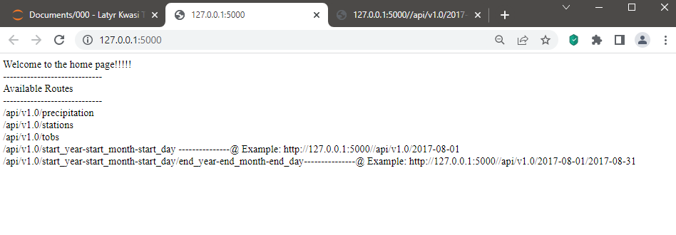
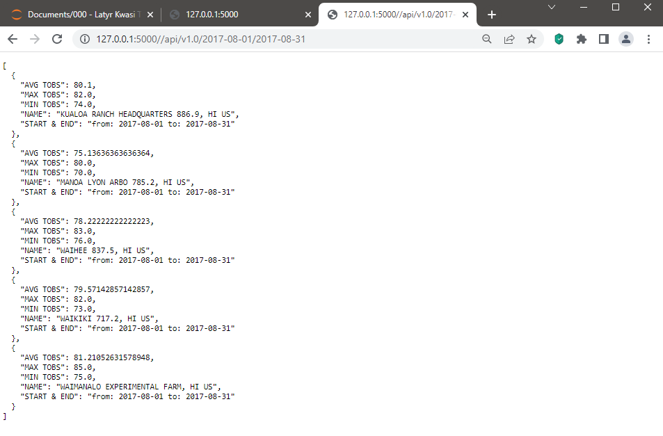

# 09_Surfs_Up_SQL_Alchemy 

In this assignment, the objective is to a Flask application to help users query data from the browser and display information based on their own criteria.

Users type in a specific URL and they get the data.

  

  

## **1. Authors**

This project was created and authored by:
* **Latyr Thiao**

## **2. Requirements / Specifications**

The [business & technical requirements](000-Instructions) that must be met by the solution.

## **3. Prerequisites**

The mandatory steps to be taken to make the code work smoothly.

### **3.1 License & Key**

Not applicable

### **3.2 Installing**

The assumption here is that your computer is running on Windows 10.
Feel free to adjust if you are using a Mac OS or any other operating system.

What software do you need and how to install them?

* Any web browser (Chrome, ...) 
* Any IDE that enable to write or read code (VS Code, ...)

## **4. Tools & Coding Languages**

The following tools and coding languages were used:
* Python/Pandas
* SQLAlchemy
* Flask

## **5. Data Source(s)**

The data used as input is coming from the following sources:
*  [Data source](001-Resources)

## **6. Run the code**

### ** The code is located here**
The code is available as follows:
* Part 1: [Jupyter Notebook](sqlalchemy-challenge.ipynb)
* Part 2: [Flask app](app.py)

## **7. User Acceptance Testing**

See related document to learn more about acceptence criteria:  
* [See instructions](000-Instructions)

## **8. Deployment**

* Download this entire repository
* Run the [Jupyter Notebook](sqlalchemy-challenge.ipynb)
* Run the [Flask app](app.py) using any IDE (e.g: VS Code, ...)
* Open any browser and go to the URL assigned by VS Code (Example: http://127.0.0.1:5000)
* Follow instructions displayed on the website

## **9. Expected result**

The outcome should be similar to the below:

  

 

  

 
